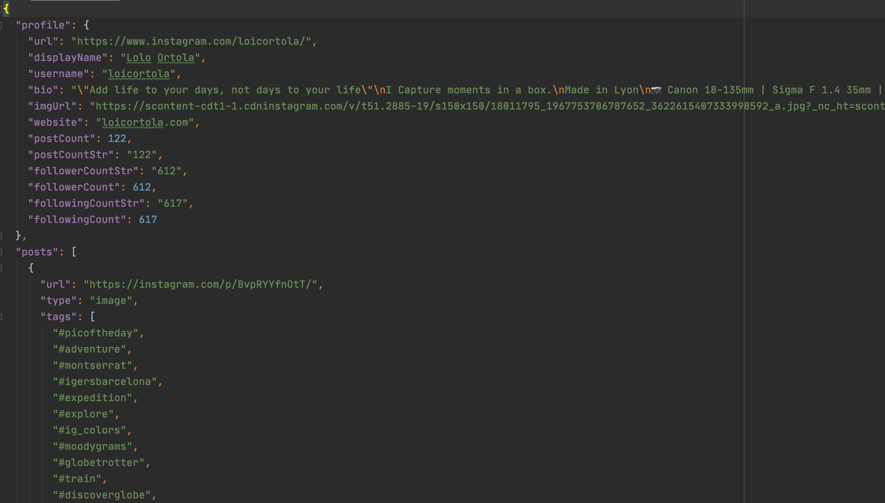

# insta-crawler

<h1 align="center">
	
</h1>

[](https://www.npmjs.com/package/insta-crawler)
[](https://hub.docker.com/r/resourcepool/insta-crawler)
[](https://travis-ci.org/resourcepool/insta-crawler)
[](https://david-dm.org/resourcepool/insta-crawler)

> Crawl the content of any instagram public page with no token or login

Inspired by [instagram-profilecrawl](https://github.com/nacimgoura/instagram-profilecrawl)

## Install

With NPM:
```bash
npm i --global insta-crawler
```

With Yarn:
```bash
yarn add global insta-crawler
```

## Usage

```bash
$ insta-crawler --help

  Usage
    $ insta-crawler <name>

  Options
    --output -o          define output format (JSON, YAML)
    --limit -l           get only the number of post defined by the limit

  Examples
    $ insta-crawler loicortola
    $ insta-crawler loicortola -o yaml
```

## Run with docker
```bash
# Crawl profile of instagram user **loicortola** and export content to dest.json
docker run -e IGER=loicortola resourcepool/insta-crawler >> dest.json
# Crawl profile of instagram user **barackobama** limiting to the two latest posts and export content to barack.json
docker run -e IGER=barackobama -e LIMIT=2 resourcepool/insta-crawler >> barack.json
# Crawl profile of instagram user **loicortola** and export content to subdirectory **out/loicortola.yaml**
docker run -e IGER=loicortola -e OUTPUT=yaml -v ./out:/home/node/app/out resourcepool/insta-crawler
```

## Example

You can find an example in the example folder.




## License

MIT © [Resourcepool](https://github.com/resourcepool)
